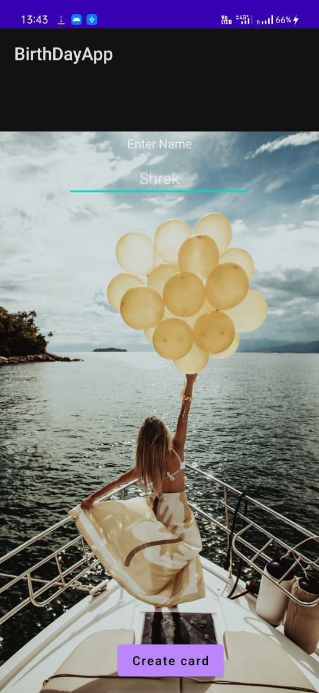
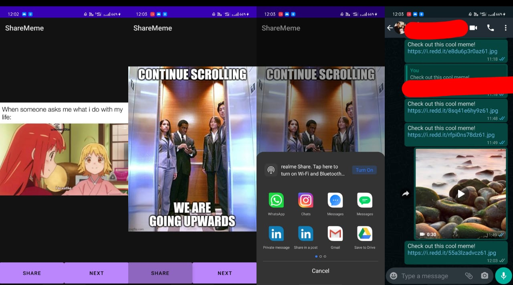

# AndriodDevelopment

 #### Mini project 1 (Birthday Greeting App):
   #### Day1
    ##### Constraint Layout, text view, margin, dp vs pixle, buttons, input, id of elements.
    
   #### Day2
    ##### Enabling new activity, Toast, Taking user input
    
   #### Day3
    ##### Paasing Data from one screen to another, Intent, startActivity(), inserting images, 
          intent.putExtra(), intent.getStringExtra(),
          Horizontal bias, Vertical bias, dp vs sp.
          

  #### Mini project 2 (Meme Sharing App):
   #### Day1
    ##### wireframing, avatar, guidelines, API definition.
          Working on the first sceen of app.
          
   #### Day2
    ##### Volley Library, Advantages of volley library, dependencies,
          Sending sinple request for API call, manifest, 
          creating a new request, glide.
   #### Day3
    ##### Adding progress bar, enabling share button, using intent to share,
          dealing with volley using singleton
  
